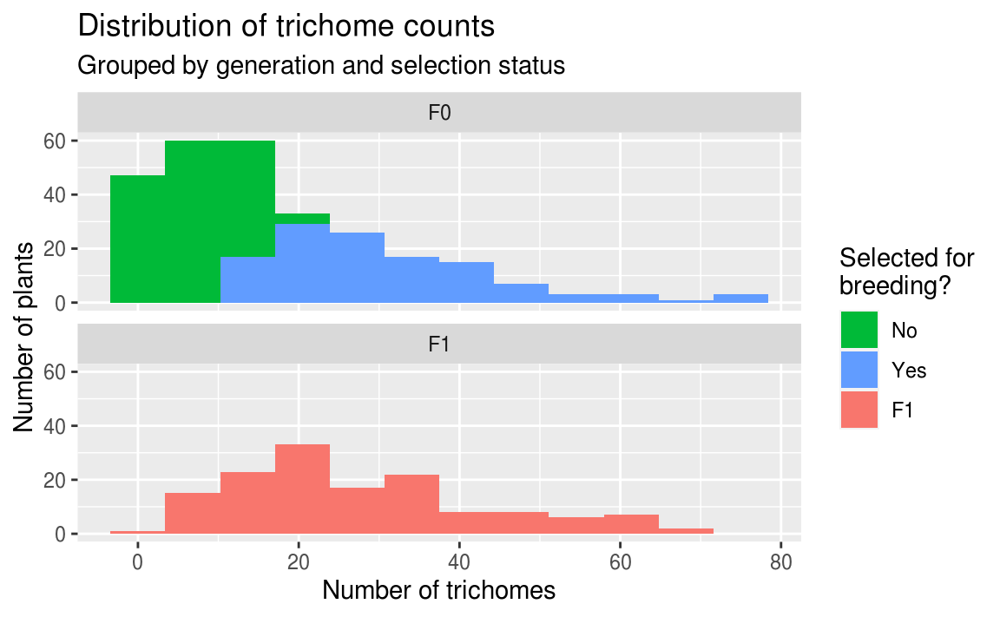

# (PART) Artificial Selection {-}

# Artificial Selection

## Introduction

In this activity you will apply what you learned in the Finch Example and the Bluestem Variation activities to analyze a new dataset.

Students at Minnesota State University Moorhead conducted an experiment to determine the effect of artificial selection in Wisconsin Fast Plants (*Brassica rapa*). The students grew plants for 10 days and then counted the number of trichomes (hairlike structures) on the edge of the first true leaf of each plant. The 75% of plants with the fewest trichomes were removed from the population. The remaining plants were allowed to flower, were fertilized with each other, and produced seeds. Those seeds were planted, and the offspring generation were allowed to grow for 10 days. At that point the students counted the trichomes on the offspring genertation.

Presumably, if the number of trichomes is a heritable trait, the mean number of trichomes should have shifted from the parent generation to the offspring generation. If so, this would be an example of **artificial selection**.

## The Question

The question you are trying to answer in this activity is:

<blockquote class="text-success">Does the number of trichomes on Fast Plants (<i>Brassica rapa</i>) plants vary between the F0 (parent) and F1 (offspring) generations.</blockquote>

## Create Project

Follow these directions to get started:

1. Go to [RStudio Cloud](https://rstudio.cloud/) and sign in. 
2. On the left, under Spaces, click on **Course Workspace**
3. Click the **Start** button on the **Artificial Selection Project** assignment.

## Find the data

When your project starts, look at the **Files** tab in the lower right pane.

There are two files you should take note of:
- [fastplant_data.xlsx](fastplant_data.xlsx) - this is the data file you will use. If it's not in your project folder, download it here and upload to the folder.
- beak-length.R - this is a copy of the [Beak Length R Script](beak-length-script.html) from the Finch Analysis.

## Create a new script

We suggest you start your assignment by creating a new script and copying the code from beak_length.R into it. Alternatively you can open **beak-length.R** and go to File > Save As... to save a copy of the script. A good name might be something like **fastplant.R**.

## Look at the fast plant data

In your new script, adjust the code so that it reads the fastplant_data.xlsx instead of finches_data.xlsx. Run the code and note the data object which appeared in your Environment tab. Click on the blue table icon to the right of the object name to open the data viewer window.

Inspect the data.

Each row in the dataset represents an individual plant.

The variables in the dataset are:

- **generation**. The generation the plant belonged to? (values include `"F0"` or `"F1"`)
- **trichome_count**. The number of trichomes the plant had. (values are numeric integers)
- **selected**. For the F0 generation, was the individual plant selected for breeding? (values include, `"yes"`, `"no"`, or `"NA"` if the plant was from the F1 generation)

Ask yourself:

- Which variable contains the numeric variable that was measured or counted? This is the response variable, which you will summarize by calculating the mean.
- Which variable would you use to group the plants? Remember you are trying to compare the response variable at two points in time. Which variable groups plants into two points in time?

## Your assignment

Your objective in this lab is to generate the results that will answer the question above, specifically by producing the following:

- One histogram showing how the distribution of numbers of trichomes varied between generations. It should also show which plants in the F0 generation were selected for breeding and which were not.
- One bar chart showing how the mean number of trichomes varied between generations. Include a 95% confidence interval around the means.
- Two figure legends describing these figures.
- One paragraph describing the results of the analysis, including the results of a *t*-test to test for a difference between the means.

To answer the question, you should:

1. Modify remaining code for use with the fast plant data
2. Plot a histogram with facets for each generation (F0 and F1)
    - Instead of setting the fill color to vary by generation, set it to vary by whether or not the plants were **selected** for breeding. This is the only place you will use the **selected** variable
    - Remove the line `guides(fill = FALSE) +` to show the fill color legend
    - For help, see [A new variation] below
3. Summarize trichome count by generation
4. Create a bar chart showing the mean trichome count in each generation (with confidence intervals)
5. Conduct a t-test to test if the difference in means is statistically significant

For a reminder on how to perform the analysis and writing steps, see the Bluestem Variation activity.

When you are finished:

- Paste your two (2) figures into a Word document, add figure legends and a RESULTS paragraph, and upload it to your *lab* D2L page under Assessments > Assignments > Data Lab 2.

### A new variation

In the finch and bluestem analyses, you created a histogram for each group and also colored the histograms differently for each group.

In theory, there is no reason you can't use a different variable to color the histograms.

For example, here is the finch data colored by `sex`:


```r
# histogram of beak length, grouped by survival, colored by sex
ggplot(
  data = finches,
  mapping = aes(x = beak_length,
                fill = sex)           # color the boxes by gender
) +
  geom_histogram(bins = 14) +
  facet_wrap(~ outcome, ncol = 1) +   # put each outcome in its own panel
  labs(
    title = "Distribution of beak lengths",
    subtitle = "Grouped by sex and outcome",
    x = "Beak Length (mm)",
    y = "Number of Birds"
  )
```


For your current assignment, put each generation of plants on its own panel, and set the fill color of the columns by whether the plants were **selected** for breeding or not.

Remove the line `guides(fill = FALSE) +` to show the fill color legend.

In *your* figures, do not use subtitles and set your titles to say `"Figure 1."` and `"Figure 2."`.

For example:




