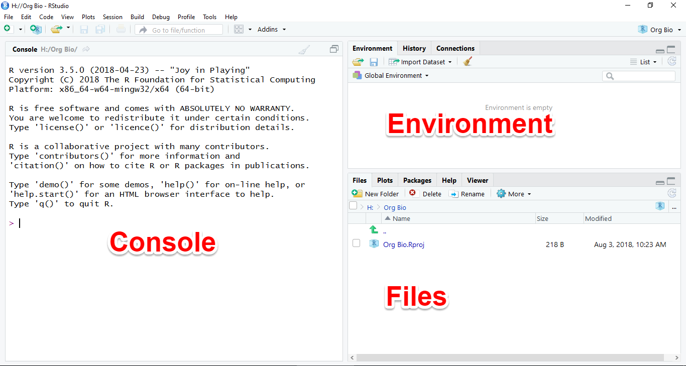
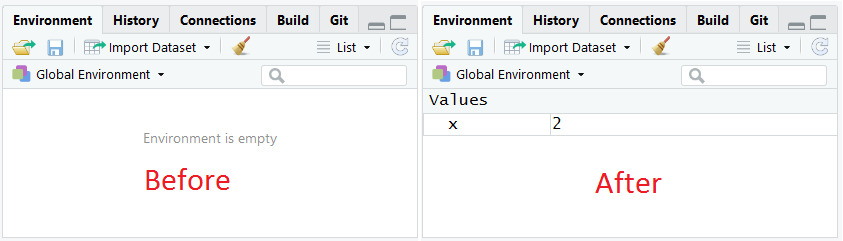

# R as a Calculator

In this section, you will learn how to use the Console Window to run commands as you perform basic arithmetic operations. You will learn the basics of using functions, and finally learn about creating objects using the assignment operator.

## The RStudio IDE

When you first open RStudio, you will see a window with three panes, the left pane will be on a tab named **Console**, the upper right pane will be on a tab named **Environment**, and the bottom right pane will be on a tab named **Files**, like this:



For now we will use the Console and Environment tabs.

## The Console tab

The Console is where you enter commands (code) for R to interpret.

To give it a try, place your cursor in the Console window by clicking in it. You should see a greater than sign `>` (called the "prompt") with a blinking cursor next to it.

Type the number `2` and press the enter key. Pressing enter is like asking R a question. R will evaluate the code you typed (yes, it's really computer code!) and print the output, the answer to your question, on the screen like this: 

    `[1] 2`

<p class="text-success font-weight-bold">Congratulations, you just wrote your first computer program!</p>

The `2` is the answer to your question and the `[1]` indicates that the answer had one part. For the most part you can ignore the number in brackets.

For the rest of this tutorial, we will use the following notation to indicate code that you should type into the console, and what the output should look like:


```r
1
#> [1] 1
```

Note that in our examples, we do not show the prompt and we add two hash marks `#>` to indicate lines of output.

<span class="label label-info">Tip</span> If you ever try to type something in the console and nothing happens, it may be because some other pane has RStudio's attention. Click the Console pane and make sure the blinking cursor is showing.

## R as a calculator

You can think of R as a giant calculator. You type in a series of numbers and operators (`+`, `-`, `/`, `*`, etc.), press enter, and it evaluates what you typed and prints the output in the console.

Give it a try:


```r
2 + 2
#> [1] 4
4 - 1
#> [1] 3
2 * 3
#> [1] 6
7 / 3
#> [1] 2.333333
```

R uses standard MDAS order of precedence for operators: multiply, then divide, then add, then subtract. To change the order of operations you can use parentheses:


```r
2 + 2 * 3
#> [1] 8
(2 + 2) * 3
#> [1] 12
```

You can use exponentials like this:


```r
3^2    # three squared is nine
#> [1] 9
```

Any text following a hash tag (pound sign) is ignored, which allows you to include comments in your code as seen above.

## Assign values

Much like a human brain, R is not only capable of performing calculations, but also of remembering things, of storing them for later. This is accomplished using the *assignment* operator `<-` like this:


```r
x <- 2
```

Here we have told R to create space in its memory, store the number two there, and name that space "x". Now, whenever we refer to `x`,  R will know we mean `2`.

Notice that the above code did not produce any output in the Console. After performing an assignment operation, you need to type the name of the object and press enter. Try printing `x` in the console:


```r
x
#> [1] 2
```

You can now use `x` anywhere in your code, and R will always know what you mean:


```r
x * 5
#> [1] 10
```

## The Environment tab

You may also have noticed that when you ran the assignment command, the *Environment* pane changed. Instead of saying "Environment is empty", it now has a list of values, with one named "x".



Try it again and watch how the environment changes:


```r
y <- 7
```

And you can use as many of these objects as you want in the same bit of code:


```r
y / x
#> [1] 3.5
z <- y + (x / 2)
```

Try switching the Environment tab from List view to Grid view by clicking the word List.

To remove all the objects from the environment, you can click the broom button. If you switch to Grid view you can have the option of only removing the checked objects.

## Functions

Some mathematical operations have no operator. For these you must use what is known as a **function**. For example, to take a square root:


```r
sqrt(9)
#> [1] 3
```

A function consists of the name of the function followed by parentheses, with a list of *arguments* inside the parentheses. Some functions take one argument, some take more, and some take none at all.

A very commonly used function is `c()`, the *combine* function. This combines multiple values into what's known as a *vector*:


```r
k <- c(1, 2, 10, 4.7, 5.0)
k
#> [1]  1.0  2.0 10.0  4.7  5.0
```

There are some functions that take vectors as arguments. For example, the the `length()` function returns the number of elements, or length, of a vector object.


```r
length(k)
#> [1] 5
```

Useful mathematical functions include:


```r
median(k)  # median value
#> [1] 4.7
mean(k)    # mean value
#> [1] 4.54
sd(k)      # standard deviation
#> [1] 3.501143
```

You can even nest functions. In the example below, the `c()` function is evaluated first, and its value is used as the argument for the length function.


```r
length(c(1, 2, 10, 4.7, 5.0)) # nested function
#> [1] 5
```

Combining several of these features together, you can calculate the standard error of the mean (SEM) and a confidence interval around the mean for any set of numbers:


```r
n <- length(k) # sample size
n
#> [1] 5
sem <- sd(k) / sqrt(n) # standard error of the mean
sem
#> [1] 1.565759
```

Once you have calculated the SEM you can use it to estimate the upper and lower limits of a 95% confidence interval like this:


```r
mean(k) + 1.96 * sem  # upper limit
#> [1] 7.608887
mean(k) - 1.96 * sem  # lower limit
#> [1] 1.471113
c(mean(k) + 1.96 * sem, mean(k) - 1.96 * sem)
#> [1] 7.608887 1.471113
```

## Self-assessment

Imagine you collected a sample of data which consisted of the following values:

`6.05 4.89 3.32 4.93 5.25 5.04 4.91 2.84 5.60 5.34`

Use the skills you have learned to answer the following questions:

1. What is the sample size?
2. What is the mean?
3. What is the median?
4. What is the standard deviation?
5. What is the standard error of the mean?
6. What is the 95% confidence interval? [two values]

<span class="label label-info">Tip</span> If you plan on using the same object names for the self assessment as you did for the tutorial (for example, `k` and `n`), it might be a good idea to clear your environment first. That way you won't accidentally use the previous value of `n` (`5`) in your self assessment. To do this, click the broom icon in the Environment tab.

Once you are done, you can expand the section below to see the correct answers:

<p>
  <a class="btn btn-primary" data-toggle="collapse" href="#answers" role="button" aria-expanded="false" aria-controls="collapseExample">
    Show Answers
  </a>
</p>
<div class="collapse" id="answers">
  <div class="card card-body">
1. `10`
2. `4.817`
3. `4.985`
4. `0.9899725`
5. `0.3130568`
6. `5.430591 4.203409`
  </div>
</div>

Once you are satisfied with your answers, you can move on to the next activity.
