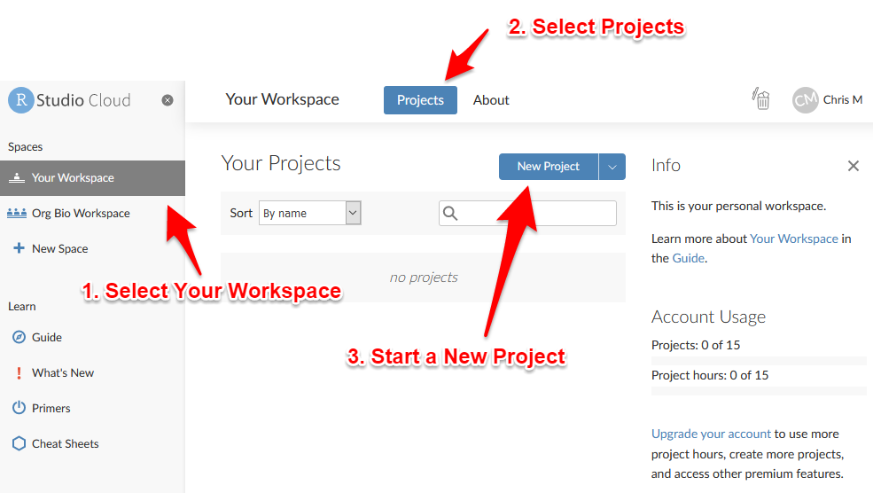

# Create A Project

## What are Projects?

RStudio projects make it straightforward to divide your work into multiple contexts, each with their own working directory, workspace, history, and source documents (scripts), and data files.


## Create a Project in RStudio Cloud

Go to [Rstudio Cloud](https://rstudio.cloud/) and sign in.

To create a new project:

1. Go to Your Workspace
2. Go to the Projects area
2. Click the button to start a New Project

```{r echo = FALSE, out.width = "75%"}

```

Wait a moment while your new project is deployed.

When the screen refreshes you will have a new, empty project and you can move on to the next step.