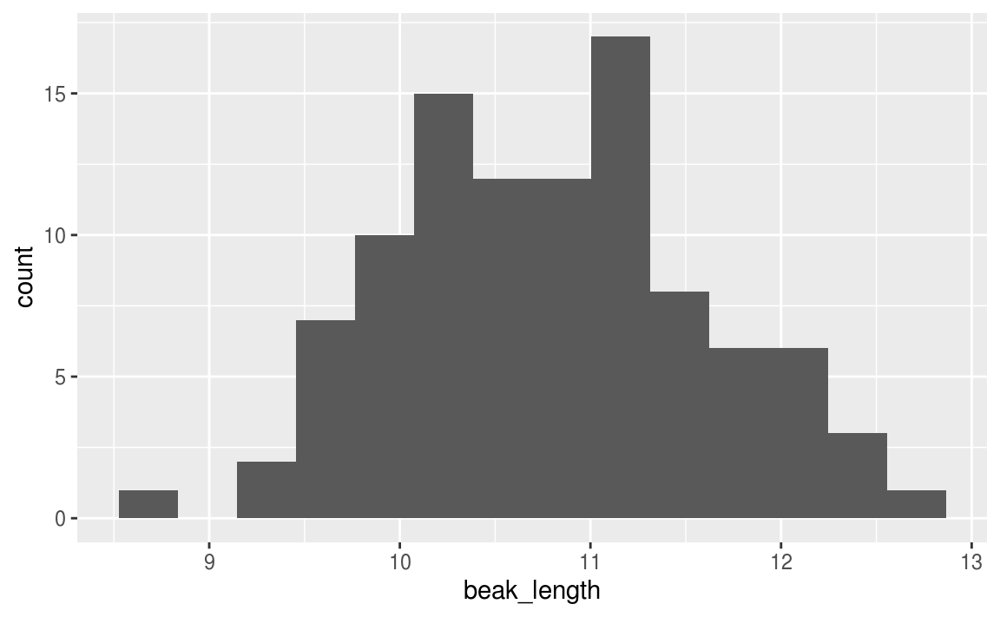
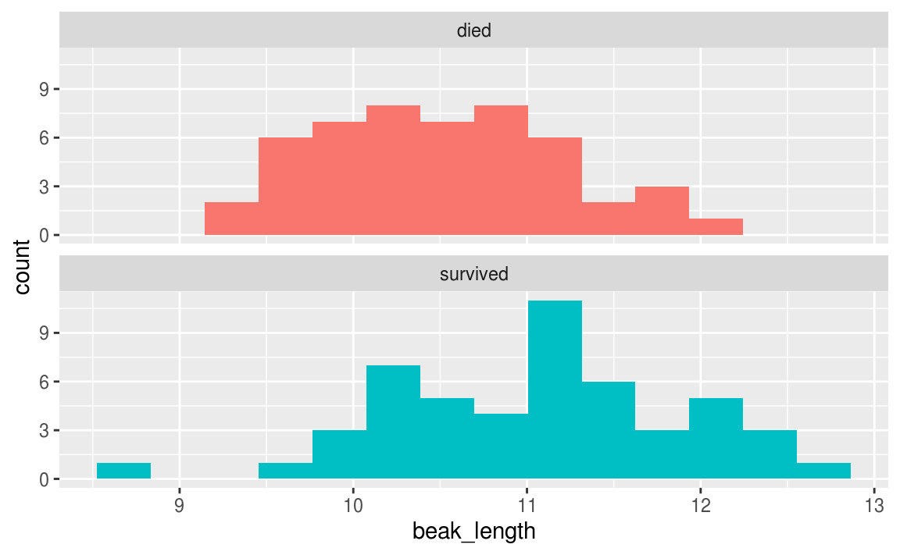
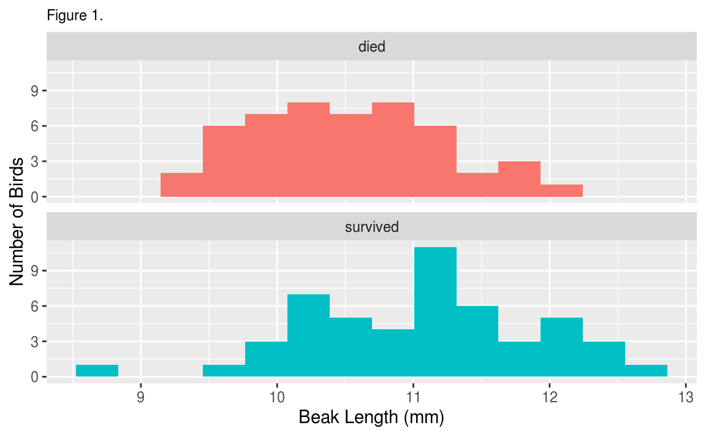
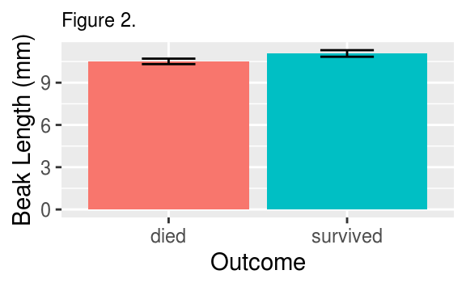

# Finch Analysis

## R scripts

### Create a script

Until now, you have run commands by typing them into the console. One of the benefits of R over programs such as Excel, however, is the ability to save your commands in the form of written. Enter the **script**! A script is simply a text file containing commands for R to execute.

Now create a new script file:

1. Click the **New File** button on the toolbar (leftmost button with a green plus sign) and choose **R Script**, or choose File > New File > R Script
2. A new pane will open above your Console pane. This is called the **Source** pane.
3. Immediately save your file by clicking on the blue floppy disk icon. 
4. Give it a memorably name like **finch analysis**. RStudio will automatically add the **.R** file extension.

### Run code from a script

Up to this point, you have been typing code into the console to run it. This works, but it has two drawback:

- You can make typos
- If you want to run code again, you have to type it again.

From now on, use this new set of steps instead:

1. <span class="text-info"><strong>Copy code from the browser. This reduces typos.</strong></span>
1. <span class="text-info"><strong>Paste into the R script.</strong></span>
1. <span class="text-info"><strong>Run code from the R script</strong></span>

The main caveat is to be careful to copy all code, especially closing parentheses `)` at the end of code chunks.

Now that you have a script, try copying and pasting this code into it. For example:


```r
sqrt(9)
```

To run the code, place your cursor on the same line as the code as click Run on the Source pane toolbar, then Run Selected Lines. Or just hold down the Command key and press the Return key. This is called a keyboard shortcut, and is written as **Cmd+Return**.

When you run the line of code, RStudio copies it to the Console pane and executes it.

Now that you've tried it, you can delete `sqrt(9)` from your script before you move on.

## R packages

In R, users share code with each other in the form of **packages**, each of which is a bundle of code, data, and other files. While R includes some basic functionality in it's "base" packages, you often need to work with other packages when doing any data analysis.

In this tutorial you will use a group of packages collectively referred to as the **tidyverse**.

Before you can use a package, you need to download and install it. In RStudio Cloud, we have already done this step for you by running `install.packages("tidyverse")` so you can skip this step.

If you are using RStudio Desktop, you will need to install the package first. In which case, you can either run the code above or use the Packages tab.

## Load the packages

Below you will see two boxes, one with comments and code, and the next with example console output. The console output is just there to show you what to expect to appear in the console when you run the given code. Console output in this tutorial always appears in a box below the code, and has two pound signs before each line like this: `##`

<p class="text-info">Copy the code in the first box below (including the comments) and paste it into your script.</p>

If you still have the code `sqrt(9)` in your script, feel free to delete it.


```r
# load packages -----------------------------------------------------------

# run every time you restart RStudio
library(readxl)     # load readxl, for reading Excel files
library(tidyverse)  # load tidyverse, for working with datasets
```

<p class="text-info">Now run BOTH lines of code</p>

Put your cursor on the first line and press Cmd+Return to run it. The cursor automatically moves to the next line, so you can press Cmd+Return again to run the next line.

You will see a warning and some messages in the Console tab, but those can be safely ignored.

You must run the `library()` each time you start RStudio. That's why it's nice to keep that code at the very top of your script.

## Read the data

Now that you have a script and have loaded the necessary packages, you're ready to get coding!

To read the data, you will use a function named `read_excel()`. Here we run that function and assign the results to an object names `finches`.


```r
# read data ----------------------------------------------------------------

# read the finches data
finches <- read_excel("finches_data.xlsx")
```


If you get an error at this point (red text in the console output) see the two warnings below.

<span class="label label-warning">Warning</span> If you didn't run the two `library()` commands, then when your run `read_excel()` you will get an error that says:

`Error in read_excel() : could not find function "read_excel"`

To solve this error, run the two `library()` commands and then retry reading the data.

## Inspect the data

<p class="text-success">To look at an object you have just created, print it to the console window by <strong>typing its name and running it</strong>:</p>


```r
# print the results in the console
finches
#> # A tibble: 100 x 12
#>    band species sex   first_adult_year last_year outcome weight  wing tarsus
#>   <dbl> <chr>   <chr>            <dbl>     <dbl> <chr>    <dbl> <dbl>  <dbl>
#> 1     9 Geospi… unkn…             1975      1977 died      14.5  67     18  
#> 2    12 Geospi… fema…             1975      1977 died      13.5  66     18.3
#> 3   276 Geospi… unkn…             1976      1977 died      16.4  64.2   18.5
#> 4   278 Geospi… unkn…             1976      1977 died      18.5  67.2   19.3
#> 5   283 Geospi… male              1976      1977 died      17.4  70.2   19.3
#> 6   288 Geospi… unkn…             1976      1977 died      16.3  71.2   20.3
#> # … with 94 more rows, and 3 more variables: beak_length <dbl>,
#> #   beak_depth <dbl>, beak_width <dbl>
```

The first thing you notice is that this object is not a vector like the objects you were working with before. Instead, it's a **tibble**, which is an object that stores tabular data.

The first line of the output gives the data type (tibble) and dimensions of the data (number of rows x number of columns). In the tidyverse, columns are referred to as "variables".

The first 10 rows are shown, as well as the first few variables. How many variables depends on how wide your Console window is.

For each variable, it's name is given, followed by the type of data. Most of the time we worth with either numeric data (`<dbl>`) or text data (`<chr>`).

If there are more than 10 rows, or more variables than can fit on the screen, there will be a sentence at the end saying "... with xx more rows, and x more variables", followed by a list of the unshown variables.

A quick way of seeing the first few observations for all variables is to use the `glimpse()` function:


```r
# take a quick look at all the variables in the dataset
glimpse(finches)
#> Rows: 100
#> Columns: 12
#> $ band             <dbl> 9, 12, 276, 278, 283, 288, 293, 294, 298, 307, 311, …
#> $ species          <chr> "Geospiza fortis", "Geospiza fortis", "Geospiza fort…
#> $ sex              <chr> "unknown", "female", "unknown", "unknown", "male", "…
#> $ first_adult_year <dbl> 1975, 1975, 1976, 1976, 1976, 1976, 1976, 1976, 1976…
#> $ last_year        <dbl> 1977, 1977, 1977, 1977, 1977, 1977, 1977, 1977, 1977…
#> $ outcome          <chr> "died", "died", "died", "died", "died", "died", "die…
#> $ weight           <dbl> 14.50, 13.50, 16.44, 18.54, 17.44, 16.34, 15.74, 16.…
#> $ wing             <dbl> 67.00, 66.00, 64.19, 67.19, 70.19, 71.19, 67.19, 68.…
#> $ tarsus           <dbl> 18.00, 18.30, 18.47, 19.27, 19.27, 20.27, 17.57, 18.…
#> $ beak_length      <dbl> 9.20, 9.50, 9.93, 11.13, 12.13, 10.63, 9.93, 11.33, …
#> $ beak_depth       <dbl> 8.3, 7.5, 8.0, 10.6, 11.2, 9.1, 9.5, 10.5, 8.4, 8.6,…
#> $ beak_width       <dbl> 8.1, 7.5, 7.6, 9.4, 9.5, 8.8, 8.9, 9.1, 8.2, 8.4, 8.…
```

If you want to see the entire dataset, click the name of the data object in the Environment tab, or run `View(finches)`. This will open a handy data viewer window. Once you are done looking at the data, close the window and continue.

## Plot a histogram

The first step in any data analysis is always to plot the data.

Because we want to compare means between two groups, a useful plot is a **histogram**, which shows how often each value (or range of values) was observed.

Plotting in the tidyverse is most easily accomplished using the `ggplot()` function and its associated helper functions.

### Basic histogram

To plot a basic histogram of the `beak_length` variable, use the following code. Note the use of a `+` after the `ggplot()` function. Copy this code to your script and run it. RStudio is smart enough to recognize that it should all be run together, so putting your cursor on any of these lines and typing Cmd+Return will run all the lines at once.


```r
# histogram ---------------------------------------------------------------

# histogram of beak length
ggplot(
  data = finches,                     # use the finches dataset
  mapping = aes(x = beak_length)      # put beak length on the x axis
) +
  geom_histogram(bins = 14)           # add the histogram, use 14 bins
```



You can plot histograms of other variables by changing the `x = ` part of the code. 

You can also experiment with different numbers of bins. The goal is to have enough that you can see a hump-shaped distribution, but not so many that you have too many bins with few or no observations. Try plotting a histogram with 50 bins, and another with 3 bins. Not very informational, are they?

### Add facets

Sometimes we want to see how the distribution of a variable varies among different subsets of the data. For example, to answer our question we want to see how beak length varies between birds that did or did not survive the drought. One easy way to do this is with the `facet_wrap()` function in ggplot. Note that you have to add a `+` operator after the `geom_histogram()` line.


```r
# histogram of beak length, grouped by survival
ggplot(
  data = finches,                     # use the finches dataset
  mapping = aes(x = beak_length,      # put beak length on the x axis
                fill = outcome)       # fill sets the color of the boxes
) +
  geom_histogram(bins = 14) +         # add the histogram, use 14 bins
  facet_wrap(~ outcome, ncol = 1) +   # outcome is the grouping variable
  guides(fill = FALSE)                # don't show a legend for fill color
```



### Add labels

The last thing you might want to do is spruce up your plot by adding better axis labels and removing the redundant color legend. This is done with the `labs()` function and the :


```r
# histogram of beak length, grouped by survival, with labels
ggplot(
  data = finches,                     # use the finches dataset
  mapping = aes(x = beak_length,      # put beak length on the x axis
                fill = outcome)       # fill sets the color of the boxes
) +
  geom_histogram(bins = 14) +         # add the histogram, use 14 bins
  facet_wrap(~ outcome, ncol = 1) +   # outcome is the grouping variable
  guides(fill = FALSE) +              # don't show a legend for fill color
  labs(
    title = "Figure 1.",              # title
    x = "Beak Length (mm)",           # x-axis label
    y = "Number of Birds"             # y-axis label
  ) +
  theme(plot.title = element_text(size = rel(.8)))  # make title smaller
```



### Write a figure legend

When sharing your figure with others, for example in a report or peer-reviewed journal article, you should always include a figure legend.

A good figure legend for this histogram would be:

<blockquote class="text-info">Figure 1. <strong>Distribution of beak lengths among medium ground finches (<i>Geospiza fortis</i>) grouped by outcome during the 1977 drought on Daphne Major, Galapagos archipelago.</strong> Each sample consisted of 50 individuals. Birds were banded and measured during 1975-1977 and resighted in 1978.</blockquote>

### Export your figure

You will only be turning in Assignment #2 Bluestem Analysis, so **YOU DO NOT NEED TO EXPORT THESE FIGURES** for your lab today. However, if you did want to save your figures and put them in a Microsoft Word document, here are directions for doing that:

To put your figure in a Microsoft Word document (your assignment in part 4), you must first save it as an image file on your computer. You can do this with `ggsave()`, which saves the most recent ggplot displayed.

You choose a file name, the dimensions of the output file (think about how big you want this to be when you paste it into a word document), and the units of the dimensions (e.g `"in"` for inches). For example, this code saves your histogram as a 3.5" x 3.5" PNG file:


```r
# save your most recent plot
ggsave("Beak Length Histogram.png",   # you choose a name for the file
       width = 3.5, height = 3.5,     # dimensions of saved file DO NOT CHANGE
       units = "in")                  # units for the dimensions DO NOT CHANGE
```

Look in Files tab in RStudio and you'll see a file named **Beak Length Histogram.png** now. You can click it to open the file in your computer's default image viewer.

## Summarize the data

### Summarize by group

The following code will summarize the dataset by calculating the mean, standard deviation and standard error of the mean (SEM) of the `beak_length` variable.

Notice the use of the equations you learned in Part 2.

The `group_by(outcome)` function tells R to give us separate summaries for each outcome (died vs. survived).


```r
# summarize ---------------------------------------------------------------

# summarize the dataset by outcome (survived vs. died)
beak_length_grouped_summary <- 
  finches %>% 
  group_by(outcome) %>% 
  summarize(mean = mean(beak_length),
            sd = sd(beak_length),
            n = n()) %>% 
  mutate(sem = sd / sqrt(n),
         upper = mean + 1.96 * sem,
         lower = mean - 1.96 * sem)
#> `summarise()` ungrouping output (override with `.groups` argument)

# print the results in the console
beak_length_grouped_summary
#> # A tibble: 2 x 7
#>   outcome   mean    sd     n    sem upper lower
#>   <chr>    <dbl> <dbl> <int>  <dbl> <dbl> <dbl>
#> 1 died      10.5 0.698    50 0.0987  10.7  10.3
#> 2 survived  11.1 0.840    50 0.119   11.3  10.8
```

### Plot summarized data

To plot these means and confidence intervals, you can use a bar chart with the `geom_col()` and `geom_errorbar()` functions in ggplot:


```r
# bar chart ---------------------------------------------------------------

# bar chart of mean beak lengths
ggplot(
  data = beak_length_grouped_summary,   # dont use the original finches dataset
  mapping = aes(x = outcome,            # survival on the x axis
                y = mean,               # mean beak length on the y axis
                fill = outcome)         # make died/survived different colors
) +
  geom_col() +                          # add columns
  geom_errorbar(                        # add error bars
    mapping = aes(ymin = lower,         #   lower 95% confidence limit
                  ymax = upper),        #   upper 95% confidence limit
    width = .3                          #   width of horizontal part of bars
  ) +
  guides(fill = FALSE) +                # don't show a legend for fill color
  labs(
    title = "Figure 2.",                # title
    x = "Outcome",                      # x-axis label
    y = "Beak Length (mm)"              # y-axis label
  ) +
  theme(plot.title = element_text(size = rel(.8)))  # make title smaller
```



A good figure legend for this figure would be:

<blockquote class="text-info">Figure 2. <strong>Mean beak length varied between medium ground finches (<i>Geospiza fortis</i>) that survived or died during the 1977 drought on Daphne Major, Galapagos archipelago.</strong> Each sample consisted of 50 individuals. Birds were banded and measured during 1975-1977 and resighted in 1978. Error bars represent 95% confidence intervals.</blockquote>

Export your figure:


```r
# save the beak length bar chart
# note that the dimensions are different from the histograms above
ggsave("Beak Length Bar Chart.png", 
       width = 2.5, height = 3.5, units = "in")  # DO NOT CHANGE
```

### Compare means

You have visualized the different samples, and it looks like there is a difference in the means. 


The question to ask is: could you have observed a difference as great as this if there is no real difference in the populations. Could you happen to have individuals with shorter beaks in one group simply due to an act of random samping? To answer that question, you need a statistical hypothesis test.

#### Conduct a *t*-test

A t-test will tell you if the difference in means is likely due to chance (i.e. sampling error) or not.

The *t*-test function in R is a bit picky... it requires you to give it two arguments: a vector of measurements for one group and another vector of measurements for the other group. To do this, you must perform three steps:

1. Create a vector of beak lengths for birds that died.
2. Create a vector of beak lengths for birds that survived.
3. Compare the two vectors using a t-test.

STEP 1: The following code will take a dataset, in this case `finches`, remove rows that do not meet a given criteria, and extract the column of interest as a vector, and store the result as a new object named `beak_length_died`.


```r
# t-test ------------------------------------------------------------------

# get a vector of beak lengths for birds that died
beak_length_died <-
  finches %>%                     # start with finches dataset
  filter(outcome == "died") %>%   # only include rows w/ outcome=died
  pull(beak_length)               # extract the beak_length column

# print the new object in the console... it is a vector
beak_length_died
#>  [1]  9.20  9.50  9.93 11.13 12.13 10.63  9.93 11.33  9.93 11.10 10.80  9.70
#> [13] 10.60  9.60 10.50  9.90  9.60 10.70  9.30 10.10  9.70 11.00 11.00 11.60
#> [25] 10.50 10.20  9.70 11.10 11.10 10.20 10.80 10.00 11.10 10.30 11.10 10.50
#> [37] 11.00 10.00 10.30 11.70 10.20 10.90 11.90 10.20 10.50 10.50  9.80 11.80
#> [49] 11.00 10.30
```

STEP 2: Now copy that code and change "died" to "survived" in your object name, so `beak_length_survived`, and in the filter criteria, so `outcome == "survived"`.


```r
# get a vector of beak lengths for birds that survived
beak_length_survived <-
  finches %>% 
  filter(outcome == "survived") %>% 
  pull(beak_length)

# print the results in the console
beak_length_survived
#>  [1] 11.50 10.20 12.10 11.60 10.30 11.40  8.70  9.90 10.20 10.30 11.43 11.93
#> [13] 11.03 10.63 10.83 11.23 11.23 10.23 11.63 12.23 11.03 11.13 10.93 11.03
#> [25] 10.23 11.33 10.03 10.70 10.00 12.43 11.09  9.63 11.60 11.30 12.13 12.03
#> [37] 10.63 11.83 12.43 12.73 10.33 11.03 12.53 12.13 10.43 10.53 11.23 11.23
#> [49] 10.90 10.50
```

STEP 3: Perform a t-test using the `t.test()` function:


```r
# perform a two-sample t-test assuming unequal variances
t.test(beak_length_died, beak_length_survived)
#> 
#> 	Welch Two Sample t-test
#> 
#> data:  beak_length_died and beak_length_survived
#> t = -3.6335, df = 94.807, p-value = 0.0004539
#> alternative hypothesis: true difference in means is not equal to 0
#> 95 percent confidence interval:
#>  -0.8681443 -0.2546557
#> sample estimates:
#> mean of x mean of y 
#>   10.5122   11.0736
```

#### Interpret the Results

The two numbers to focus on here are the **p-value** and the **95% confidence interval**.

The *p*-value tells you what proportion of the time you would expect to find a difference in population like these two if they were in fact the same. Scientists generally use a cutoff (or *alpha level*) of 0.05 to determine if a difference is "statistically significant". In this case, a *p*-value of 0.0004539 is much lower than 0.05, so we can reject our null hypothesis and accept our alternative hypothesis that the true difference in means is not equal to 0.

As further evidence that the difference between the means is not equal to zero, you can see that the 95% confidence interval does not include zero.

To report the findings of a t-test, for example in the Results section of a report or scientific article, you would say:

<blockquote class="text-info">Birds that survived the 1977 drought generally had longer beaks than those that died (Fig. 1). Mean beak lengths were 11.1 mm in survivors and 10.5 mm in non-survivors (Fig. 2).  This difference was stastistically significant according to a Welch's two-sample t-test assuming unequal variances (*t*=3.6335, *df*=94.807, *p*=0.0004539).</blockquote>
