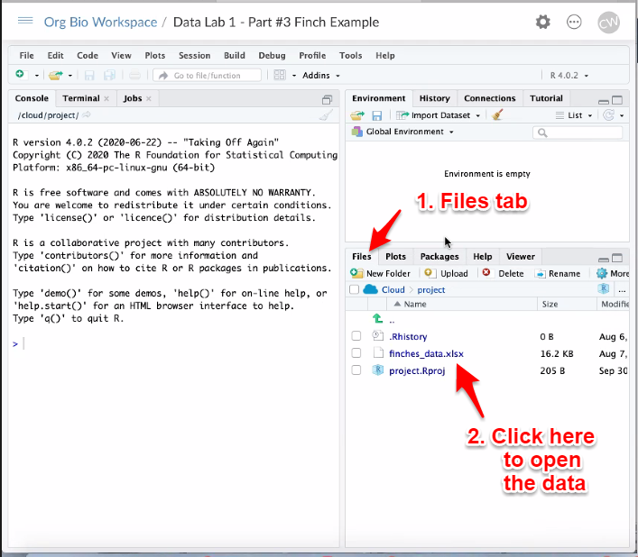

# Finch Project

## Select Workspace

If your instructor has set up a course workspace on RStudio Cloud, they will disseminate a link which will give you access to the workspace on RStudio Cloud. Open the link in a web browser, sign in to RStudio Cloud, and click to join the workspace.

Once you have joined, you will see two spaces listed under Spaces in the Navigation panel on the left. The first is **Your Workspace**, the second is the course workspace, for example **Course Workspace**. Select Course Workspace.

If your instructor has not set up a course workspace, you can just use Your Workspace.

## Start Project

In your Course Workspace, you will see a list of projects:

- Finch Example Project
- Bluestem Variation Project
- Artificial Selection Project

Click the "Start" button to open the **Finch Example Project** project. This will create your own copy of the project that can be accessed by both you and the instructor.

Click the name of the project, **Finch Example Project**, to open the project.

If your instructor has not set up a course workspace, you can just create a new project by clicking the **New Project** button. Name it **Finch Example Project**.

## Inspect Files

In the bottom right pane, click the **Files** tab.

You should see several files, including one that says **finches_data.xlsx**. This is an Excel file containing the finch data.

```{r echo = FALSE, out.width = "75%"}

```

If you want, you can click on the file name to download and open it with Microsoft Excel. 

If your instructor has not set up a course workspace, you can download the Excel file from [hhmi Biointeractive](https://www.biointeractive.org/classroom-resources/effects-natural-selection-finch-beak-size). Be sure to open the file, delete the first row, and save, so that the code shown later in this activity will work correctly.