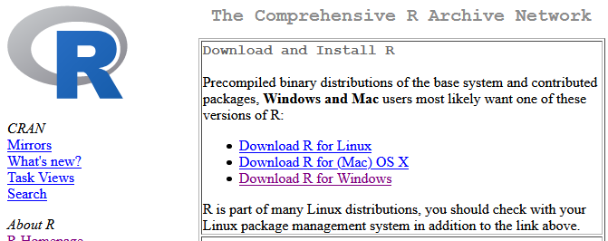
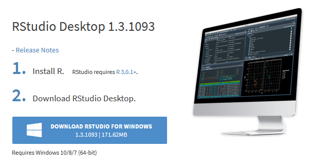

# (PART) Getting Started {-}

# Get RStudio

Your first task is to choose how you will work with R. To do that, you should understand the difference between R and RStudio, and know what your options are for running RStudio.

## About R and RStudio

**R** is a programming language and free software environment for statistical computing and graphics supported by the R Foundation for Statistical Computing. Today, R is the most commonly used software for data analysis in the biological sciences.

While it is possible to run R by itself, it is more common to run it as part of **RStudio**, a free and open-source integrated development environment (IDE) for R. For most uses, it's best to use RStudio rather than R directly.

## Desktop vs. Cloud

RStudio has a variety of products to suit different needs. The two suitable options for learning R are the free desktop version, RStudio Desktop, and the cloud version **[RStudio Cloud](https://rstudio.cloud/)**.

In this activity, we will assuming you are using RStudio Cloud, but we provide instructions on setting up both options.

If you plan to use RStudio Cloud, you can skip the next section.

### RStudio Desktop Setup

RStudio Desktop is a free program you download and install on your computer. This is a great option for advanced students or if you plan to work without internet access sometimes.

The downside of RStudio Desktop is that working on your own computer requires a bit more computer knowledge than working on the cloud. At a minimum you need to have good general computer skills such as downloading files from the internet, moving files around on your computer, remembering where your files and folders are located, etc.

To get started with RStudio Desktop, you need to first install R, then install RStudio.

#### Install R

You must install R before you install RStudio.

Directions for installing R:

1. Go to https://cran.rstudio.com/
2. Under *Download and Install R*, follow the link for your operating system, Linux, (Mac) OS X, or Windows.

3. If you chose Download R for (Mac) OS X:
    a. Download the binary file. The link will say something like "R-`paste0(R.Version()$major, ".", R.Version()$minor)`.pkg", but the version number may be different if a newer version has been released.
    b. Open the file and your Mac will install R. If you are prompted for options during installation, just select the default options.
4. If you chose Download R for Windows:
    a. Click the link for "base" or "install for the first time"
    b. Download the installer. The link will say something like "Download R 4.0.3 for Windows", but the version number may be different if a newer version has been released.
    c. Open the file and Windows will install R. If you are prompted for options during installation, just select the default options.
    
#### Install RStudio

Make sure you have installed R before you try to install RStudio.

Directions for installing RStudio:

1. Go to https://rstudio.com/products/rstudio/download/
2. Scroll down about two thirds of the page. You will see a heading that says 
RStuio Desktop `RStudio.Version()$version`.
3. Click the big blue button that says "DOWNLOAD STUDIO FOR WINDOWS"

### RStudio Cloud Setup

RStudio Cloud is basically a version of RStudio that runs in a web browser.

In this activity, you will use RStudio Cloud, an online version of RStudio that requires less initial setup and is good for learning in a classroom setting. 

In Part 1 of this lab, you will learn what R and RStudio are, how the RStudio environment is organized, and how RStudio organizes your work into Projects. To finish, you will create your first RStudio Project, which you will continue to work in for the rest of the lab.

## Open RStudio Cloud

First, make sure you have an RStudio Cloud account. Go to https://rstudio.cloud/ and click "Sign Up" or "Get Started for Free". Choose the "Cloud Free" plan and continue.

Use an email address and password of your choice (they do not have to be your MSUM ones). You will have to confirm your email address after registering. To do so, go to your email account, find the message from RStudio Cloud, and click the link to confirm the email address is yours.

Next, sign in to RStudio Cloud.

Every RStudio Cloud user gets a personal workspace, named **Your Workspace**, in which to create projects. When you sign in, you will start out in Your Workspace.

In the future, this is where you will see a list of your projects. For now, it will say "no project". Click the image below to see an example.

<figure class="figure">
  
  <figcaption class="figure-caption">Your Workspace in RStudio Cloud.</figcaption>
</figure>

## Create a Project

RStudio projects make it straightforward to divide your work into multiple contexts, each with their own working directory, workspace, history, and source documents (scripts), and data files.

To create a new project:

1. Go to Your Workspace
2. Go to the Projects area
2. Click the button to start a New Project

<figure class="figure">
  
  <figcaption class="figure-caption">Create a new project.</figcaption>
</figure>

Wait a moment while your new project is deployed.

When the screen refreshes you will have a new, empty project and you can move on to Part 2.
